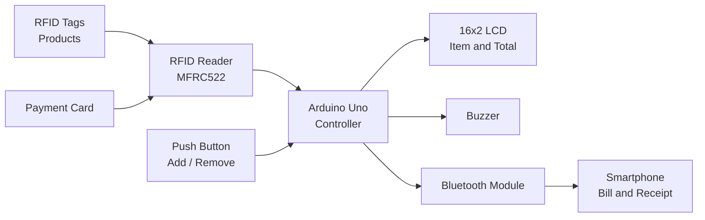
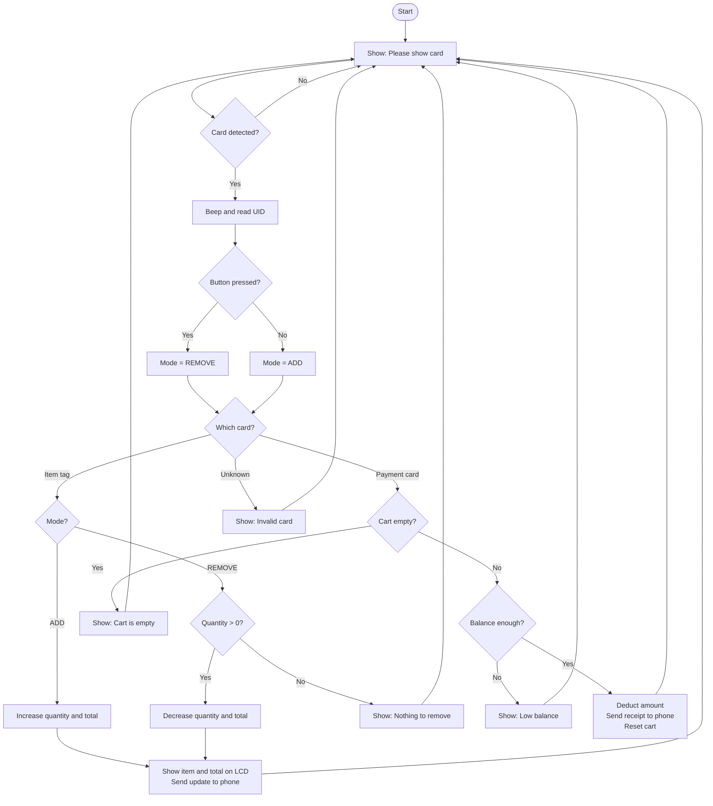

# 🛒 INTERACTIVE-SHOPPING-CART

An interactive shopping cart that adds items to the bill automatically when you tap an RFID tag, shows the running total on an LCD, and sends the final receipt to your phone over Bluetooth.

> **Team:** [D.Keerthana], [G.Sreeja], [G.Sai Sri] ; **College:** [MALLA REDDY ENGINEERING COLLEGE FOR WOMEN]
> **Guide:** [N.VISHWANANTH] ; **Department:** [ELECTRONICS AND COMMUNICATION ENGINEERING] ; **Year:** 2026


## 📑 Table of Contents

1. [Overview](#1-overview)
2. [Problem Statement](#2-problem-statement)
3. [Objectives](#3-objectives)
4. [How It Works (Simple Explanation)](#4-how-it-works-simple-explanation)
5. [Components Used](#5-components-used)
6. [Circuit Connections](#6-circuit-connections)
7. [System Block Diagram](#7-system-block-diagram)
8. [Working Flowchart](#8-working-flowchart)
9. [Item and Card Details](#9-item-and-card-details)
10. [Software and Libraries](#10-software-and-libraries)
11. [Code Explanation](#11-code-explanation)
12. [Sample Outputs](#12-sample-outputs)
13. [Testing](#13-testing)
14. [Advantages](#14-advantages)
15. [Limitations and Known Issues](#15-limitations-and-known-issues)
16. [Future Scope](#16-future-scope)
17. [Conclusion](#17-conclusion)

---

## 1. Overview

In a normal supermarket, a customer picks items, waits in a long billing queue, and the cashier scans every item one by one. This wastes time for both the customer and the store.

The **Smart Trolley** solves this by putting the billing system *inside the trolley*. Each product has an **RFID tag**. When the customer places an item in the trolley and taps its tag on the reader, the item is added to the bill instantly. The trolley shows the **running total on an LCD screen**. At the end, the customer taps their **payment card**, the amount is deducted from the card balance, and a **digital receipt is sent to their phone via Bluetooth**.

No queue. No manual scanning. No paper bill.

---

## 2. Problem Statement

- Billing counters in supermarkets have long queues.
- Cashiers must scan every item manually, which takes time.
- Customers do not know their total bill until the very end.
- If a customer changes their mind, removing an item after billing is difficult.

There is a need for a low-cost system that lets customers **track their bill live while shopping** and **pay without standing in a queue**.

---

## 3. Objectives

1. Detect products automatically using RFID tags.
2. Show the item name, price, and running total on an LCD.
3. Allow the customer to **add** and **remove** items using a mode button.
4. Let the customer pay by tapping a payment card.
5. Send a detailed bill to the customer's phone using Bluetooth.
6. Give clear alerts (buzzer and LCD messages) for errors like an empty cart, invalid card, or low balance.

---

## 4. How It Works (Simple Explanation)

Think of it in four easy steps:

| Step | What the customer does | What the trolley does |
|---|---|---|
| **1. Start** | Switches on the trolley | LCD shows *"SMART TROLLY – SHOW CARD"*, then *"Please show card"* |
| **2. Add items** | Taps a product's RFID tag on the reader | Buzzer beeps, item price and total appear on the LCD, message goes to phone |
| **3. Remove items** *(optional)* | **Holds the button** and taps the same product tag | Item is removed and the total goes down |
| **4. Pay** | Taps the payment card | Bill is checked, balance is deducted, and the final receipt is sent to the phone |

**Add / Remove mode is decided by the push button:**

- Button **not pressed** → **ADD** mode
- Button **held down** → **REMOVE** mode

---

## 5. Components Used

| # | Component | Purpose |
|---|---|---|
| 1 | Arduino Uno *(or compatible board)* | Main controller that runs the program |
| 2 | RFID Reader **MFRC522 (RC522)** | Reads the UID of each RFID tag or card |
| 3 | RFID tags / cards | One tag per product, plus payment cards |
| 4 | 16×2 LCD Display | Shows item, total, and messages |
| 5 | Bluetooth module *(e.g., HC-05 / HC-06)* | Sends the bill to the phone |
| 6 | Buzzer | Gives a beep on every scan |
| 7 | Push button | Switches between ADD and REMOVE mode |
| 8 | Potentiometer (10 kΩ) | Adjusts LCD contrast |
| 9 | Breadboard, jumper wires, power supply | Connections and power |
| 10 | Smartphone with a Bluetooth serial terminal app | Receives the bill |

---

## 6. Circuit Connections

### Pin Map (from the code)

| Module | Module Pin | Arduino Pin |
|---|---|---|
| **RFID (RC522)** | SDA / SS | D10 |
| | SCK | D13 |
| | MOSI | D11 |
| | MISO | D12 |
| | RST | A3 |
| | 3.3V / GND | 3.3V / GND |
| **LCD 16×2** | RS | D2 |
| | EN | D3 |
| | D4 | D4 |
| | D5 | D5 |
| | D6 | D6 |
| | D7 | D7 |
| **Bluetooth** | TX | A1 *(Arduino RX)* |
| | RX | A0 *(Arduino TX)* |
| **Buzzer** | + | A2 |
| **Push Button** | One leg | D8 |
| | Other leg | GND |

### Important wiring notes

- The **RC522 works at 3.3 V**. Do **not** connect it to 5 V.
- The button uses the Arduino's **internal pull-up resistor** (`INPUT_PULLUP`), so no external resistor is needed. Pressing the button pulls the pin **LOW**.
- HC-05 / HC-06 modules usually expect **3.3 V on their RX pin**, so use a small voltage divider (for example 1 kΩ + 2 kΩ) on the Arduino's A0 (TX) line.
- Connect the LCD contrast pin (V0) to the middle pin of a 10 kΩ potentiometer.

> 📷 *Add your circuit diagram or a photo of the hardware here:* ``

---

## 7. System Block Diagram



---

## 8. Working Flowchart



---

## 9. Item and Card Details

### Product prices

| Product | Price (₹) | RFID UID |
|---|---|---|
| Oil | 100 | `23F5643D` |
| Pen | 20 | `2057E02F` |
| Soap | 50 | `41F58B55` |

### Payment cards

| Card Holder | RFID UID |
|---|---|
| Keerthana | `F315030D` |
| Harshini | `092674B3` |

**Starting balance:** ₹1500 (set in the code as `int amount = 1500;`)

> 💡 **Using your own tags?** Open the Serial Monitor, tap a tag, and note the `UID Detected:` value. Then replace the `#define UID_...` lines in the code with your own values.

---

## 10. Software and Libraries

| Software / Library | Use |
|---|---|
| Arduino IDE | Writing and uploading the code |
| `SPI.h` | Communication with the RFID reader *(built-in)* |
| `MFRC522.h` | RFID reader driver *(install from Library Manager)* |
| `SoftwareSerial.h` | Bluetooth communication on pins A0/A1 *(built-in)* |
| `LiquidCrystal.h` | Controls the 16×2 LCD *(built-in)* |
| Serial Bluetooth Terminal app | Shows the bill on the phone |

**Baud rate:** 9600 for both the Serial Monitor and the Bluetooth module.

---

## 11. Code Explanation

The whole program is in one file: `smart_trolley.ino`.

### 11.1 Main variables

| Variable | Meaning |
|---|---|
| `o`, `p`, `s` | Number of Oil, Pen, and Soap in the cart |
| `cost` | Running total of the bill |
| `amount` | Prepaid balance available (starts at 1500) |
| `idleScreenShown` | Remembers whether the "Please show card" screen is already on the LCD |

### 11.2 Main functions

| Function | What it does |
|---|---|
| `setup()` | Starts Serial, Bluetooth, LCD, and the RFID reader; shows the welcome message |
| `loop()` | Waits for a card, reads its UID, checks the mode, and decides what to do |
| `beep()` | Makes a short 60 ms buzzer sound |
| `lcdstring(col, row, text)` | Prints text at a given LCD position |
| `showIdleScreen()` | Displays *"Please show card"* |
| `showItem(name, price)` | Displays the item price and the total for 1.5 seconds |
| `payment(name)` | Handles the complete payment and receipt process |

### 11.3 How a card is identified

The reader gives the card's UID as a set of bytes. The code joins them into one text string in capital letters (for example `23F5643D`) and compares it with the known UIDs:

```cpp
String uid = "";
for (byte i = 0; i < mfrc522.uid.size; i++) {
  if (mfrc522.uid.uidByte[i] < 0x10) uid += "0";
  uid += String(mfrc522.uid.uidByte[i], HEX);
}
uid.toUpperCase();
```

### 11.4 ADD / REMOVE logic

```cpp
bool removeMode = (digitalRead(BUTTON) == LOW);
```

- If `removeMode` is **false** → quantity goes up by 1 and `cost` increases by the item price.
- If `removeMode` is **true** → quantity goes down by 1 and `cost` decreases, but only if the quantity is above 0. Otherwise the LCD shows *"NOTHING TO REMOVE"*.

### 11.5 Payment logic

1. If `cost == 0` → show *"CART IS EMPTY"* and stop.
2. Show *"CARD AUTHORIZED"* and the *"FINAL BILL"*.
3. If `amount < cost` → show *"LOW BALANCE"* and stop.
4. Otherwise: `amount -= cost`, send the receipt over Bluetooth, show *"PAYMENT OK"* with the new balance, then reset `o`, `p`, `s`, and `cost` to 0.

---

## 12. Sample Outputs

### LCD screens

| Situation | Line 1 | Line 2 |
|---|---|---|
| Startup | `SMART TROLLY` | `SHOW CARD` |
| Waiting | `Please show card` | *(blank)* |
| Item added | `OIL : 100` | `TOTAL=100` |
| Nothing to remove | `OIL = 0` | `NOTHING TO REMOVE` |
| Payment start | `CARD AUTHORIZED` | *(blank)* |
| Final bill | `FINAL BILL: 220` | *(blank)* |
| Payment done | `PAYMENT OK` | `BAL=1280` |
| Empty cart | `CART IS EMPTY` | `ADD ITEMS` |
| Low balance | `LOW BALANCE` | *(blank)* |
| Wrong card | `INVALID CARD` | *(blank)* |

### Bluetooth messages on the phone

**While shopping**

```
ADDED: OIL = 100
ADDED: OIL = 100
ADDED: PEN = 20
REMOVED: PEN = 20
```

**Final receipt** *(example: 2 Oil + 1 Pen paid by Keerthana)*

```
Card Holder: Keerthana
Oil  x2 = 200
Pen  x1 = 20
Pay Success: 220
Remaining Bal: 1280
```

### Serial Monitor (for debugging)

```
SMART TROLLEY STARTED
BUTTON LOW  -> REMOVE MODE
BUTTON HIGH -> ADD MODE
UID Detected: 23F5643D
MODE: ADD
you enterred -- OIL = 100
```

> 📷 *Add screenshots of the LCD and the phone here:* `` ``

---

## 13. Testing

Tick the last column after testing each case on your hardware.

| # | Test Case | Expected Result | Done |
|---|---|---|---|
| 1 | Tap Oil tag (button not pressed) | LCD: `OIL : 100`, `TOTAL=100`; phone: `ADDED: OIL = 100` | ☐ |
| 2 | Tap Oil tag again | Total becomes 200 | ☐ |
| 3 | Hold button and tap Oil tag | Total drops by 100; phone: `REMOVED: OIL = 100` | ☐ |
| 4 | Hold button and tap Oil when none in cart | LCD: `OIL = 0` / `NOTHING TO REMOVE` | ☐ |
| 5 | Add Oil, Pen, Soap, then tap payment card | Final bill is 170; receipt lists all three items | ☐ |
| 6 | Tap payment card with an empty cart | LCD: `CART IS EMPTY` | ☐ |
| 7 | Bill greater than the balance | LCD: `LOW BALANCE`; no deduction | ☐ |
| 8 | Tap an unknown card | LCD: `INVALID CARD`, extra beep | ☐ |
| 9 | Complete a payment | Balance reduces; cart resets to zero | ☐ |
| 10 | Every scan | Buzzer beeps once | ☐ |

---

## 14. Advantages

- ✅ **No billing queue.** Payment is done from the trolley.
- ✅ **Live bill tracking.** The customer always knows the running total.
- ✅ **Easy item removal** with the mode button.
- ✅ **Digital receipt** sent to the phone.
- ✅ **Low cost**, using common and easily available components.
- ✅ **Clear feedback** through the LCD and the buzzer.
- ✅ **Simple to extend** with more products.

---

## 15. Limitations and Known Issues

| Limitation | Details |
|---|---|
| Only 3 products | Oil, Pen, and Soap are hard-coded. |
| Hard-coded UIDs | New tags must be added by editing the code and re-uploading. |
| One shared balance | `amount` is a single variable, so both payment cards share the same ₹1500. |
| Balance not saved | The balance resets to ₹1500 whenever the Arduino is powered off. |
| Not real payment | Payment is simulated inside the Arduino; no bank or wallet is connected. |
| Basic security | Anyone with a copied tag UID can use it. |
| Delays in code | `delay()` calls pause the program for a moment after each scan. |
| LCD text too long | `NOTHING TO REMOVE` is 17 characters, but the LCD shows only 16, so the last letter is cut off. Shorten it (for example to `NOTHING TO DEL`) to fix this. |
| No item-count display | The LCD shows the price and total, not the quantity of each item. |

---

## 16. Future Scope

1. Store product names and prices in a **database or SD card** instead of the code.
2. Keep a **separate balance for each payment card**, saved in EEPROM.
3. Use a **Wi-Fi module (ESP8266 / ESP32)** to upload bills to the cloud.
4. Build a **mobile app** to view the bill and pay using UPI.
5. Add a **load cell (weight sensor)** to detect if an item was placed without scanning.
6. Add **anti-theft alerts** at the store exit.
7. Show the **quantity of each item** on a larger display.
8. Add **more products** and a store-side admin panel.

---

## 17. Conclusion

The Smart Trolley shows how simple, low-cost electronics can make shopping faster and easier. By combining **RFID identification**, an **Arduino controller**, an **LCD display**, and **Bluetooth communication**, the system removes the need for manual scanning and long billing queues. It supports adding and removing items, checks for an empty cart or low balance, and sends a clear digital receipt to the customer. With the improvements listed in the future scope, this prototype can be developed into a complete automated billing solution for supermarkets.
